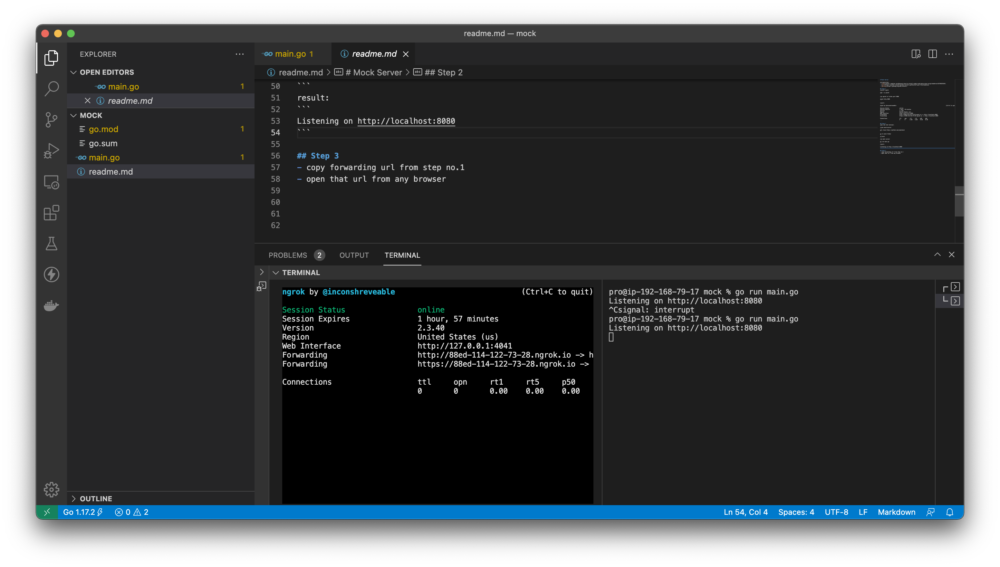

# Mock Server

prerequisites:
- [node](https://medium.com/@hayasnc/how-to-install-nodejs-and-npm-on-mac-using-homebrew-b33780287d8f)
- [git](https://github.com/git-guides/install-git#install-git-from-homebrew)
- [golang](https://golang.org/doc/install)

## Step 1
install ngrok
```
npm i -g ngrok
```

run ngrok to listen port 8080
```
ngrok http 8080
```

## Step 2
open new tab terminal.

clone mock-server:
```
git clone https://github.com/ynwd/mock
```

go to mock folder
```
cd mock
```
run mock server
```
go run main.go
```

## Step 3
- copy forwarding url from step no.1
- open that url from any browser



